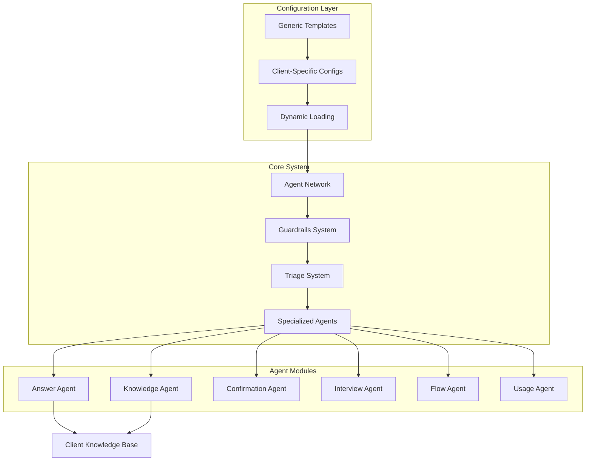
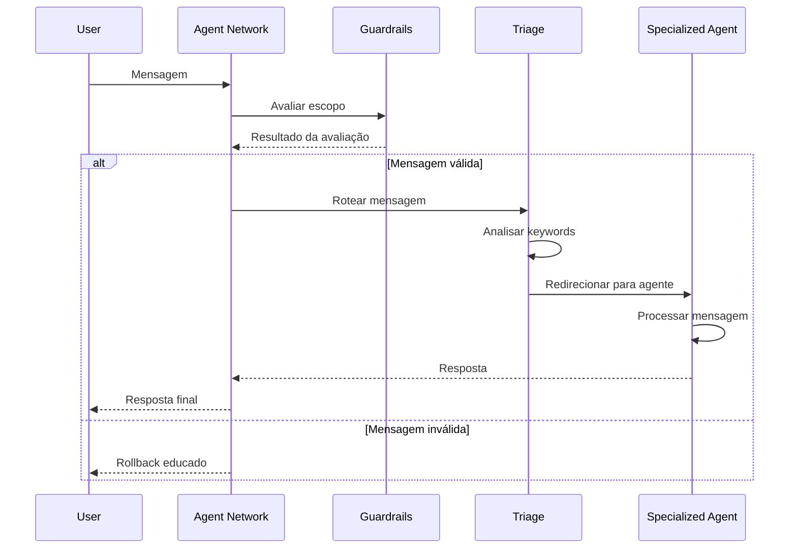
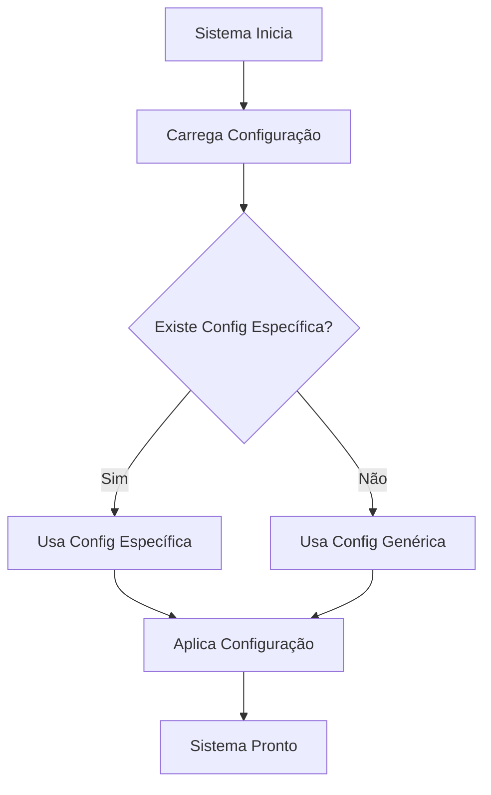

# 🏗️ Arquitetura do Sistema - AtendentePro

## 📋 Visão Geral

O AtendentePro é um sistema de agentes especializados com arquitetura modular, sistema de guardrails inteligente e configuração dinâmica por cliente. O sistema foi projetado para ser genérico e reutilizável, com configurações específicas isoladas em templates.

## 🎯 Princípios Arquiteturais

### 1. Modularidade
- **Separação por domínio:** Cada agente tem responsabilidades específicas
- **Baixo acoplamento:** Módulos independentes com interfaces claras
- **Alta coesão:** Funcionalidades relacionadas agrupadas

### 2. Configurabilidade
- **Templates genéricos:** Base reutilizável para qualquer cliente
- **Configurações específicas:** Customização por cliente
- **Fallback inteligente:** Sistema robusto com múltiplos níveis

### 3. Extensibilidade
- **Adição de agentes:** Fácil inclusão de novos agentes
- **Personalização:** Configurações específicas por domínio
- **Integração:** APIs claras para extensões

## 🏛️ Arquitetura de Alto Nível



## 🔧 Componentes Principais

### 1. Core System

#### Agent Network (`agent_network.py`)
- **Responsabilidade:** Orquestração de agentes
- **Funcionalidades:**
  - Gerenciamento de handoffs
  - Contexto de conversação
  - Roteamento entre agentes

#### Guardrails System (`guardrails.py`)
- **Responsabilidade:** Proteção de escopo
- **Funcionalidades:**
  - Avaliação de mensagens usando IA
  - Rollback educado para mensagens inválidas
  - Configuração dinâmica por cliente

#### Triage System (`Triage/`)
- **Responsabilidade:** Roteamento inteligente
- **Funcionalidades:**
  - Análise de keywords
  - Regras de prioridade
  - Redirecionamento para agentes especializados

### 2. Agent Modules

#### Estrutura Padrão por Agente
```
AgentName/
├── agent_name_agent.py      # Definição do agente OpenAI
├── agent_name_config.py     # Configuração Python
├── agent_name_config.yaml   # Configuração YAML
├── agent_name_models.py     # Modelos de dados
└── agent_name_prompts.py    # Prompts dinâmicos
```

#### Agentes Especializados

**Answer Agent**
- Respostas técnicas diretas
- Especialização em domínio específico
- Integração com base de conhecimento

**Knowledge Agent**
- Acesso à base de conhecimento
- Sistema RAG avançado
- Busca semântica em documentos

**Confirmation Agent**
- Validações e confirmações
- Verificação de informações
- Processos de aprovação

**Interview Agent**
- Entrevistas estruturadas
- Coleta de informações
- Questionários dinâmicos

**Flow Agent**
- Gerenciamento de fluxos
- Processos de trabalho
- Etapas sequenciais

**Usage Agent**
- Orientações de uso
- Tutoriais e ajuda
- Navegação no sistema

### 3. Configuration System

#### Template System
```
Template/
├── guardrails_config.yaml    # Guardrails genérico
├── triage_config.yaml        # Triage genérico
└── [CLIENTE]/
    ├── guardrails_config.yaml
    ├── triage_config.yaml
    ├── *_config.yaml         # Configurações específicas
    └── knowledge_documentos/  # Base de conhecimento
```

#### Carregamento Dinâmico
1. **Busca específica:** `Template/[CLIENTE]/`
2. **Fallback genérico:** `Template/`
3. **Fallback padrão:** Raiz do projeto

## 🔄 Fluxos Principais

### 1. Fluxo de Processamento de Mensagem



### 2. Fluxo de Configuração



## 🎯 Padrões de Design

### 1. Strategy Pattern
- **Aplicação:** Diferentes estratégias de roteamento
- **Implementação:** Múltiplas regras de prioridade
- **Benefício:** Flexibilidade na lógica de roteamento

### 2. Template Method Pattern
- **Aplicação:** Construção de prompts
- **Implementação:** Métodos base com customizações
- **Benefício:** Consistência com personalização

### 3. Factory Pattern
- **Aplicação:** Criação de agentes
- **Implementação:** Configuração dinâmica
- **Benefício:** Flexibilidade na criação de agentes

### 4. Observer Pattern
- **Aplicação:** Sistema de handoffs
- **Implementação:** Notificações entre agentes
- **Benefício:** Desacoplamento de componentes

## 🔒 Segurança e Confiabilidade

### 1. Sistema de Guardrails
- **Proteção de escopo:** Previne respostas inadequadas
- **Rollback educado:** Respostas apropriadas para mensagens inválidas
- **Configuração flexível:** Adaptável a diferentes domínios

### 2. Validação de Configuração
- **Schemas YAML:** Validação de estrutura
- **Fallbacks robustos:** Sistema funciona mesmo com configuração incompleta
- **Logs detalhados:** Rastreabilidade de problemas

### 3. Tratamento de Erros
- **Graceful degradation:** Sistema continua funcionando com falhas parciais
- **Logs estruturados:** Facilita debugging
- **Recovery automático:** Tentativas de recuperação

## 📈 Escalabilidade

### 1. Horizontal
- **Múltiplos clientes:** Configurações isoladas
- **Agentes independentes:** Escalabilidade por módulo
- **Base de conhecimento:** Distribuição de documentos

### 2. Vertical
- **Otimização de prompts:** Redução de tokens
- **Cache de configurações:** Carregamento eficiente
- **Pool de conexões:** Gerenciamento de recursos

## 🔧 Manutenibilidade

### 1. Código Limpo
- **Dead code removido:** Sistema otimizado
- **Imports organizados:** Dependências claras
- **Documentação completa:** Facilita manutenção

### 2. Testes Abrangentes
- **Testes unitários:** Cobertura por módulo
- **Testes de integração:** Fluxos completos
- **Testes de comportamento:** Validação de funcionalidades

### 3. Monitoramento
- **Métricas de performance:** KPIs por módulo
- **Logs estruturados:** Rastreabilidade
- **Alertas proativos:** Detecção de problemas

## 🚀 Roadmap de Evolução

### Fase 1: Consolidação (Atual)
- ✅ Sistema de guardrails implementado
- ✅ Triage dinâmico funcionando
- ✅ Configurações por cliente
- ✅ Testes automatizados

### Fase 2: Otimização
- [ ] Cache de configurações
- [ ] Otimização de prompts
- [ ] Métricas avançadas
- [ ] Dashboard de monitoramento

### Fase 3: Extensão
- [ ] Novos tipos de agentes
- [ ] Integração com APIs externas
- [ ] Sistema de plugins
- [ ] Interface web

### Fase 4: Inteligência Avançada
- [ ] Machine learning para roteamento
- [ ] Análise de sentimento
- [ ] Personalização por usuário
- [ ] Predição de necessidades

---

**Conclusão:**
A arquitetura do AtendentePro foi projetada para ser robusta, flexível e escalável. O sistema modular permite fácil manutenção e extensão, enquanto o sistema de configuração dinâmica garante adaptabilidade para diferentes clientes e domínios.
