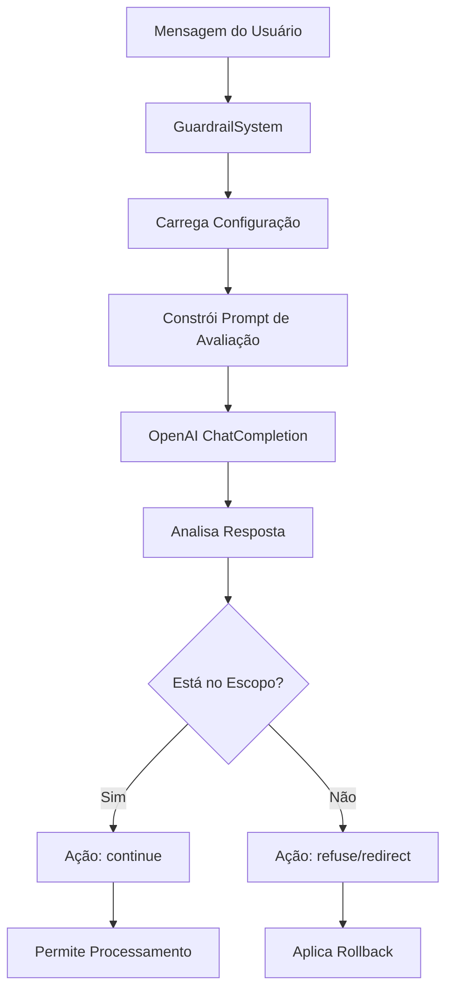

# 🛡️ Módulo Guardrails - Documentação Técnica

## 📋 Visão Geral

O módulo Guardrails é responsável por proteger o sistema contra mensagens fora do escopo configurado. Ele avalia mensagens do usuário usando IA e aplica rollback educado quando necessário.

## 🏗️ Arquitetura do Módulo

```
Core System/
├── guardrails.py                    # Sistema principal de guardrails
├── guardrails_config_default.yaml   # Configuração genérica padrão
└── Template/[CLIENTE]/
    └── guardrails_config.yaml       # Configuração específica do cliente
```

## 🔧 Componentes Principais

### 1. GuardrailSystem (`guardrails.py`)

**Responsabilidade:** Avaliação de mensagens usando OpenAI ChatCompletion.

#### Classe Principal:

```python
class GuardrailSystem:
    def __init__(self, config_path: Optional[str] = None):
        self.config = GuardrailConfig(config_path)
    
    async def evaluate_message(self, message: str, agent_name: str) -> GuardrailOutput:
        # Avalia se mensagem está no escopo
        # Retorna: reasoning, is_in_scope, confidence, suggested_action
```

#### Métodos Principais:

**`evaluate_message(message, agent_name)`**
- Avalia mensagem contra escopo do agente
- Usa OpenAI ChatCompletion para análise contextual
- Retorna `GuardrailOutput` com resultado

**`_build_evaluation_prompt(message, agent_config)`**
- Constrói prompt para avaliação
- Usa apenas campo `about` da configuração
- Formato estruturado para análise

### 2. GuardrailConfig (`guardrails.py`)

**Responsabilidade:** Carregamento e gerenciamento de configurações.

#### Funcionalidades:

**Carregamento Inteligente:**
1. `Template/[CLIENTE]/guardrails_config.yaml` (específico)
2. `guardrails_config_default.yaml` (genérico)
3. Fallback para configuração vazia

**Estrutura de Configuração:**
```yaml
agent_scopes:
  triage_agent:
    about: |
      Descrição detalhada do escopo do agente.
      Inclui o que DEVE e NÃO DEVE fazer.
  
  answer_agent:
    about: |
      Descrição específica para Answer Agent.
```

### 3. GuardrailOutput (`guardrails.py`)

**Responsabilidade:** Estrutura de resposta padronizada.

```python
@dataclass
class GuardrailOutput:
    reasoning: str      # Explicação da análise
    is_in_scope: bool   # True se está no escopo
    confidence: float   # Confiança (0.0 a 1.0)
    suggested_action: str  # "continue", "redirect", "refuse"
```

## 📊 Fluxo de Funcionamento



## ⚙️ Configuração

### Arquivo: `guardrails_config.yaml`

```yaml
agent_scopes:
  triage_agent:
    about: |
      O Triage Agent da [CLIENTE] é responsável por [FUNÇÃO].
      Ele deve reconhecer perguntas sobre: [TÓPICOS_VÁLIDOS].
      Não deve responder sobre: [TÓPICOS_INVÁLIDOS].
  
  answer_agent:
    about: |
      O Answer Agent fornece [TIPO_DE_RESPOSTAS].
      Especializado em [DOMÍNIO_ESPECÍFICO].
      Limitações: [O_QUE_NÃO_FAZ].
```

### Estrutura do Prompt de Avaliação

```
Analise se a mensagem do usuário está de acordo com o escopo do agente.

SOBRE O AGENTE:
{about}

MENSAGEM DO USUÁRIO:
"{message}"

INSTRUÇÕES:
1. Analise se a mensagem está relacionada ao escopo do agente
2. Considere tanto o que o agente DEVE fazer quanto o que NÃO DEVE fazer
3. Forneça uma pontuação de confiança (0.0 a 1.0)
4. Sugira uma ação: "continue", "redirect", "refuse"

FORMATO DE RESPOSTA:
RAZÃO: [explicação detalhada]
ESCOPO: [true/false]
CONFIANÇA: [0.0-1.0]
AÇÃO: [continue/redirect/refuse]
```

## 🎯 Exemplos de Uso

### Exemplo 1: Mensagem Válida

**Entrada:** "Qual o código IVA para industrialização?"

**Processo:**
1. Sistema carrega escopo do `triage_agent`
2. Avalia contra descrição fiscal
3. **Resultado:** `is_in_scope=True`, `action="continue"`

### Exemplo 2: Mensagem Inválida

**Entrada:** "Quem descobriu o Brasil?"

**Processo:**
1. Sistema carrega escopo do `triage_agent`
2. Avalia contra descrição fiscal
3. **Resultado:** `is_in_scope=False`, `action="refuse"`

### Exemplo 3: Mensagem Ambígua

**Entrada:** "Preciso de ajuda com um problema"

**Processo:**
1. Sistema avalia contexto
2. **Resultado:** `is_in_scope=False`, `action="redirect"`

## 🔍 Debugging e Troubleshooting

### Problema: Guardrails Não Detecta Mensagens Fora do Escopo

**Verificações:**
1. Configuração `about` está detalhada o suficiente?
2. OpenAI API key está configurada?
3. Prompt de avaliação está sendo construído corretamente?

### Problema: Falsos Positivos

**Soluções:**
1. Refinar descrição no campo `about`
2. Adicionar mais exemplos de limitações
3. Ajustar threshold de confiança

### Logs de Debug

```python
# Adicionar logging para debug
import logging

logger = logging.getLogger(__name__)

async def evaluate_message(self, message: str, agent_name: str):
    logger.debug(f"Avaliando mensagem: {message}")
    logger.debug(f"Agente: {agent_name}")
    # ... resto da lógica
```

## 🚀 Extensibilidade

### Adicionar Novo Agente ao Guardrails

1. **Atualizar `guardrails_config.yaml`:**
```yaml
agent_scopes:
  novo_agent:
    about: |
      O Novo Agent é responsável por [FUNÇÃO].
      Especializado em [DOMÍNIO].
      Não deve responder sobre [LIMITAÇÕES].
```

2. **Sistema detecta automaticamente** o novo agente

### Personalizar Lógica de Avaliação

Modificar `_build_evaluation_prompt()` em `guardrails.py`:

```python
def _build_evaluation_prompt(self, message: str, agent_config: Dict[str, Any]) -> str:
    # Lógica personalizada aqui
    # Ex: adicionar contexto específico, regras customizadas
    return custom_prompt
```

### Integração com Outros Sistemas

```python
# Exemplo: Integração com sistema de logs
class CustomGuardrailSystem(GuardrailSystem):
    async def evaluate_message(self, message: str, agent_name: str):
        result = await super().evaluate_message(message, agent_name)
        
        # Log personalizado
        if not result.is_in_scope:
            self.log_out_of_scope(message, agent_name, result.reasoning)
        
        return result
```

## 📈 Métricas e Monitoramento

### KPIs Importantes

- **Taxa de Detecção:** % de mensagens fora do escopo detectadas
- **Precisão:** % de classificações corretas
- **Confiança Média:** Score médio de confiança das avaliações
- **Tempo de Resposta:** Latência da avaliação

### Métricas por Agente

```python
# Exemplo de coleta de métricas
class MetricsGuardrailSystem(GuardrailSystem):
    def __init__(self):
        super().__init__()
        self.metrics = defaultdict(list)
    
    async def evaluate_message(self, message: str, agent_name: str):
        start_time = time.time()
        result = await super().evaluate_message(message, agent_name)
        
        # Coletar métricas
        self.metrics[agent_name].append({
            'confidence': result.confidence,
            'is_in_scope': result.is_in_scope,
            'response_time': time.time() - start_time
        })
        
        return result
```

## 🔗 Integração com Outros Módulos

### Triage Agent
- Guardrails avalia antes do roteamento
- Previne roteamento de mensagens inválidas
- Mantém foco no domínio configurado

### Agent Network
- Integração com `input_guardrails`
- Aplicação automática em todos os agentes
- Rollback consistente em toda a rede

### Sistema de Configuração
- Carregamento dinâmico de configurações
- Fallback inteligente para templates genéricos
- Configuração específica por cliente

## 🧪 Testes

### Testes Unitários

```python
# Exemplo de teste
async def test_guardrails_out_of_scope():
    system = GuardrailSystem()
    result = await system.evaluate_message("quem descobriu o brasil", "triage_agent")
    
    assert not result.is_in_scope
    assert result.suggested_action in ["refuse", "redirect"]
    assert result.confidence >= 0.6
```

### Testes de Integração

```python
# Teste com configuração real
async def test_guardrails_integration():
    system = GuardrailSystem("Template/White_Martins/guardrails_config.yaml")
    result = await system.evaluate_message("código IVA", "triage_agent")
    
    assert result.is_in_scope
    assert result.suggested_action == "continue"
```

---

**Próximos Passos:**
- [ ] Configurar escopos específicos do cliente
- [ ] Testar com mensagens reais
- [ ] Monitorar métricas de performance
- [ ] Refinar descrições baseado no feedback
