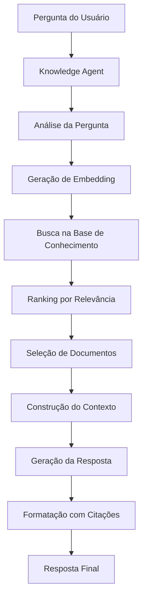

# 📚 Módulo Knowledge - Documentação Técnica

## 📋 Visão Geral

O módulo Knowledge é responsável por gerenciar e acessar a base de conhecimento do sistema. Ele inclui funcionalidades de RAG (Retrieval-Augmented Generation) para busca semântica em documentos e fornece respostas baseadas em conhecimento estruturado.

## 🏗️ Arquitetura do Módulo

```
Knowledge/
├── knowledge_agent.py       # Agente principal de conhecimento
├── knowledge_config.py      # Configuração do agente
├── knowledge_models.py      # Modelos de dados
├── knowledge_prompts.py     # Prompts para o agente
├── knowledge_templates.py   # Templates de resposta
├── rag_agent.py            # Sistema RAG avançado
├── test_rag_agent.py       # Testes do sistema RAG
└── README-RAG_GENERATION.md # Documentação específica do RAG
```

## 🔧 Componentes Principais

### 1. Knowledge Agent (`knowledge_agent.py`)

**Responsabilidade:** Agente principal que responde perguntas baseadas em conhecimento.

#### Características:
- Integração com sistema de guardrails
- Acesso à base de conhecimento
- Respostas contextualizadas
- Handoffs para outros agentes quando necessário

### 2. RAG Agent (`rag_agent.py`)

**Responsabilidade:** Sistema avançado de Retrieval-Augmented Generation.

#### Funcionalidades Principais:

**Processamento de Documentos:**
- Suporte a múltiplos formatos (PDF, DOCX, TXT, PPTX)
- Extração de texto e metadados
- Geração de embeddings
- Armazenamento estruturado

**Busca Semântica:**
- Embeddings usando OpenAI
- Busca por similaridade de cosseno
- Ranking de resultados por relevância
- Filtros por tipo de documento

**Geração de Respostas:**
- Contexto baseado em documentos relevantes
- Respostas citando fontes
- Formatação estruturada
- Fallback para respostas genéricas

### 3. Sistema de Configuração

#### Knowledge Config (`knowledge_config.yaml`)

```yaml
agent_name: "Knowledge Agent"
description: "Acessa base de conhecimento sobre documentos fiscais"

rag_config:
  documents_path: "knowledge_documentos/"
  embedding_model: "text-embedding-ada-002"
  max_results: 5
  similarity_threshold: 0.7
  
document_types:
  - "pdf"
  - "docx" 
  - "txt"
  - "pptx"

response_format:
  include_sources: true
  max_context_length: 2000
  citation_style: "numbered"
```

## 📊 Fluxo de Funcionamento



## ⚙️ Configuração

### Estrutura de Diretórios

```
Template/[CLIENTE]/
├── knowledge_config.yaml
└── knowledge_documentos/
    ├── pdf/              # Documentos PDF
    ├── docx/             # Documentos Word
    ├── txt/              # Arquivos de texto
    ├── pptx/             # Apresentações
    ├── json_format/      # Documentos processados
    └── embedding/         # Embeddings gerados
```

### Configuração do RAG

```yaml
# knowledge_config.yaml
rag_config:
  documents_path: "knowledge_documentos/"
  embedding_model: "text-embedding-ada-002"
  max_results: 5
  similarity_threshold: 0.7
  chunk_size: 1000
  chunk_overlap: 200
  
processing:
  auto_process: true
  update_embeddings: false
  clean_text: true
  
response:
  include_sources: true
  max_context_length: 2000
  citation_style: "numbered"
```

## 🎯 Exemplos de Uso

### Exemplo 1: Busca Simples

**Entrada:** "Como fazer uma carta de correção?"

**Processo:**
1. Gera embedding da pergunta
2. Busca documentos similares
3. Encontra documento sobre "Carta de Correção"
4. **Resposta:** Instruções detalhadas com citação

### Exemplo 2: Busca Complexa

**Entrada:** "Qual a diferença entre ICMS e IPI?"

**Processo:**
1. Gera embedding da pergunta
2. Busca múltiplos documentos relevantes
3. Combina informações de diferentes fontes
4. **Resposta:** Comparação detalhada com múltiplas citações

### Exemplo 3: Sem Resultados

**Entrada:** "Como fazer um bolo de chocolate?"

**Processo:**
1. Busca na base de conhecimento
2. Não encontra documentos relevantes
3. **Resposta:** "Não encontrei informações sobre este tópico na base de conhecimento."

## 🔍 Debugging e Troubleshooting

### Problema: Documentos Não São Encontrados

**Verificações:**
1. Documentos estão na pasta correta?
2. Configuração `documents_path` está correta?
3. Embeddings foram gerados?

### Problema: Respostas Irrelevantes

**Soluções:**
1. Ajustar `similarity_threshold`
2. Melhorar qualidade dos documentos
3. Refinar `chunk_size` e `chunk_overlap`

### Problema: Performance Lenta

**Otimizações:**
1. Reduzir `max_results`
2. Usar cache de embeddings
3. Otimizar `chunk_size`

### Logs de Debug

```python
# Adicionar logging para debug
import logging

logger = logging.getLogger(__name__)

def search_documents(self, query_embedding):
    logger.debug(f"Buscando documentos para: {query}")
    logger.debug(f"Threshold: {self.similarity_threshold}")
    # ... resto da lógica
```

## 🚀 Extensibilidade

### Adicionar Novo Tipo de Documento

1. **Implementar processador:**
```python
def process_custom_format(file_path):
    # Lógica de processamento específica
    return extracted_text, metadata
```

2. **Atualizar configuração:**
```yaml
document_types:
  - "pdf"
  - "docx"
  - "custom_format"  # Novo tipo
```

### Personalizar Busca

```python
class CustomRAGAgent(RAGAgent):
    def search_documents(self, query_embedding):
        # Lógica de busca personalizada
        # Ex: filtros específicos, ranking customizado
        return custom_search_results
```

### Integração com Outros Sistemas

```python
# Exemplo: Integração com sistema de logs
class LoggingRAGAgent(RAGAgent):
    def generate_response(self, query, context):
        result = super().generate_response(query, context)
        
        # Log da consulta
        self.log_query(query, len(context), result.sources)
        
        return result
```

## 📈 Métricas e Monitoramento

### KPIs Importantes

- **Taxa de Sucesso:** % de perguntas com respostas relevantes
- **Precisão:** Qualidade das respostas geradas
- **Cobertura:** % de documentos utilizados
- **Tempo de Resposta:** Latência da busca e geração

### Métricas por Documento

```python
# Exemplo de coleta de métricas
class MetricsRAGAgent(RAGAgent):
    def __init__(self):
        super().__init__()
        self.document_metrics = defaultdict(int)
    
    def search_documents(self, query_embedding):
        results = super().search_documents(query_embedding)
        
        # Contar uso de documentos
        for doc in results:
            self.document_metrics[doc['source']] += 1
        
        return results
```

## 🔗 Integração com Outros Módulos

### Triage Agent
- Knowledge Agent é um destino comum do roteamento
- Recebe perguntas sobre documentação e procedimentos
- Fornece respostas baseadas em conhecimento

### Sistema de Guardrails
- Protege contra perguntas fora do escopo
- Mantém foco em documentos relevantes
- Aplica rollback quando necessário

### Agent Network
- Handoffs para outros agentes quando necessário
- Integração com contexto de conversação
- Compartilhamento de informações relevantes

## 🧪 Testes

### Testes Unitários

```python
# Exemplo de teste
def test_document_processing():
    agent = RAGAgent()
    result = agent.process_document("test.pdf")
    
    assert result['text'] is not None
    assert result['metadata']['type'] == 'pdf'
    assert len(result['chunks']) > 0
```

### Testes de Integração

```python
# Teste com documentos reais
def test_knowledge_search():
    agent = KnowledgeAgent()
    result = agent.search_knowledge("código IVA")
    
    assert len(result['sources']) > 0
    assert result['answer'] is not None
    assert result['confidence'] > 0.7
```

## 📚 Documentação Adicional

### README-RAG_GENERATION.md

Documentação específica sobre:
- Processamento de documentos
- Geração de embeddings
- Otimizações de performance
- Troubleshooting avançado

### Exemplos Práticos

```python
# Exemplo de uso básico
from AtendentePro.Knowledge.rag_agent import RAGAgent

agent = RAGAgent("Template/White_Martins/knowledge_config.yaml")
result = agent.search_knowledge("Como fazer uma carta de correção?")

print(f"Resposta: {result['answer']}")
print(f"Fontes: {result['sources']}")
```

---

**Próximos Passos:**
- [ ] Adicionar documentos à base de conhecimento
- [ ] Configurar parâmetros de busca
- [ ] Testar com perguntas reais
- [ ] Monitorar métricas de performance
- [ ] Otimizar baseado no feedback
