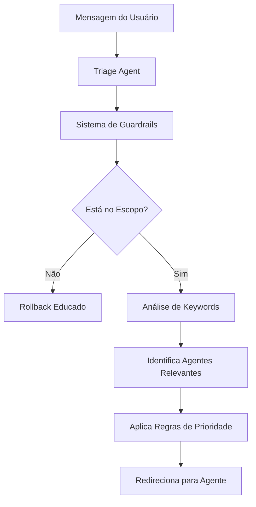

# 🎯 Módulo Triage - Documentação Técnica

## 📋 Visão Geral

O módulo Triage é responsável pelo roteamento inteligente de conversas entre agentes especializados. Ele analisa mensagens do usuário e direciona para o agente mais adequado baseado em keywords e regras de prioridade.

## 🏗️ Arquitetura do Módulo

```
Triage/
├── triage_agent.py      # Definição do agente OpenAI
├── triage_models.py     # Funções de configuração e lógica
└── triage_prompt.py     # Construção dinâmica de prompts
```

## 🔧 Componentes Principais

### 1. Triage Agent (`triage_agent.py`)

**Responsabilidade:** Definição do agente OpenAI com integração ao sistema de guardrails.

```python
triage_agent = Agent[ContextNote](
    name="Triage Agent",
    handoff_description="A triage agent that can delegate requests to appropriate agents",
    instructions=triage_prompts_agent,
    handoffs=[],
    input_guardrails=get_guardrails_for_agent("triage_agent"),
)
```

**Características:**
- Integração com sistema de guardrails
- Prompts construídos dinamicamente
- Handoffs configuráveis

### 2. Triage Models (`triage_models.py`)

**Responsabilidade:** Lógica de configuração e construção dinâmica de módulos.

#### Funções Principais:

**`load_triage_config(config_path=None)`**
- Carrega configuração do `triage_config.yaml`
- Busca inteligente: específico → genérico → fallback
- Retorna dicionário com configurações

**`load_guardrail_config(config_path=None)`**
- Carrega configuração do `guardrails_config.yaml`
- Mesma lógica de busca inteligente
- Usado para templates de análise

**`get_triage_keywords()`**
- Retorna keywords de todos os agentes
- Usado para construção do módulo ROUTE

**`get_routing_rules()`**
- Retorna regras de prioridade e agente padrão
- Define ordem de roteamento

**`build_route_module()`**
- Constrói módulo ROUTE dinamicamente
- Inclui keywords e regras de roteamento
- Formatação automática para o prompt

### 3. Triage Prompt (`triage_prompt.py`)

**Responsabilidade:** Construção dinâmica de prompts usando configurações.

#### Módulos do Prompt:

**INTRO**
- Apresentação do agente
- Carrega descrição do `guardrails_config.yaml`
- Contexto específico do cliente

**ANALYZE**
- Template de análise de escopo
- Rollback para mensagens fora do escopo
- Integração com sistema de guardrails

**ROUTE**
- Keywords por agente (carregadas dinamicamente)
- Regras de prioridade
- Lógica de roteamento

## 📊 Fluxo de Funcionamento



## ⚙️ Configuração

### Arquivo: `triage_config.yaml`

```yaml
agent_keywords:
  answer_agent:
    keywords: ["resposta", "solução", "ajuda"]
    description: "Fornece respostas diretas"
  
  knowledge_agent:
    keywords: ["documento", "manual", "procedimento"]
    description: "Acessa base de conhecimento"

routing_rules:
  priority_order:
    - "answer_agent"
    - "knowledge_agent"
    - "confirmation_agent"
  default_agent: "knowledge_agent"
```

### Arquivo: `guardrails_config.yaml`

```yaml
agent_scopes:
  triage_agent:
    about: |
      O Triage Agent é responsável por rotear conversas.
      Especializado em [DOMÍNIO_ESPECÍFICO].
      Não responde sobre [LIMITAÇÕES].
```

## 🎯 Exemplos de Uso

### Exemplo 1: Roteamento por Keywords

**Entrada:** "Preciso de ajuda com um documento"

**Processo:**
1. Sistema identifica keyword "documento"
2. Mapeia para `knowledge_agent`
3. Redireciona para Knowledge Agent

### Exemplo 2: Prioridade de Múltiplos Agentes

**Entrada:** "Como resolver um problema técnico específico?"

**Processo:**
1. Identifica keywords: "resolver" (answer) + "técnico" (knowledge)
2. Aplica prioridade: `answer_agent` > `knowledge_agent`
3. Redireciona para Answer Agent

### Exemplo 3: Fallback

**Entrada:** "Olá, preciso de orientação"

**Processo:**
1. Não identifica keywords específicas
2. Usa `default_agent: knowledge_agent`
3. Redireciona para Knowledge Agent

## 🔍 Debugging e Troubleshooting

### Problema: Roteamento Incorreto

**Verificações:**
1. Keywords estão corretas no `triage_config.yaml`?
2. Regras de prioridade estão definidas?
3. Agente padrão está configurado?

### Problema: Prompt Não Carrega Configurações

**Verificações:**
1. Arquivo `triage_config.yaml` existe?
2. Estrutura YAML está correta?
3. Caminho de busca está correto?

### Logs de Debug

```python
# Para debug, adicionar prints nas funções:
def load_triage_config(config_path=None):
    # ... código ...
    print(f"Carregando configuração de: {config_path}")
    return config
```

## 🚀 Extensibilidade

### Adicionar Novo Agente

1. **Atualizar `triage_config.yaml`:**
```yaml
agent_keywords:
  novo_agent:
    keywords: ["nova", "palavra", "chave"]
    description: "Descrição do novo agente"
```

2. **Atualizar regras de prioridade:**
```yaml
routing_rules:
  priority_order:
    - "answer_agent"
    - "novo_agent"  # Adicionar aqui
    - "knowledge_agent"
```

3. **Sistema detecta automaticamente** o novo agente

### Personalizar Lógica de Roteamento

Modificar função `build_route_module()` em `triage_models.py`:

```python
def build_route_module() -> str:
    # Lógica personalizada aqui
    # Ex: análise de contexto, histórico, etc.
    return custom_route_logic
```

## 📈 Métricas e Monitoramento

### KPIs Importantes

- **Taxa de Roteamento Correto:** % de mensagens direcionadas ao agente certo
- **Tempo de Resposta:** Latência do sistema de triage
- **Fallback Rate:** % de mensagens que usam agente padrão

### Logs Recomendados

```python
# Adicionar logging para monitoramento
import logging

logger = logging.getLogger(__name__)

def route_message(message, agent):
    logger.info(f"Roteando mensagem para {agent}")
    # ... lógica de roteamento
```

## 🔗 Integração com Outros Módulos

### Sistema de Guardrails
- Detecta mensagens fora do escopo
- Aplica rollback antes do roteamento
- Mantém foco no domínio configurado

### Agent Network
- Integra com rede de agentes
- Gerencia handoffs entre agentes
- Mantém contexto de conversação

### Knowledge Agent
- Acesso à base de conhecimento
- Documentos específicos do cliente
- Embeddings e busca semântica

---

**Próximos Passos:**
- [ ] Configurar keywords específicas do cliente
- [ ] Testar roteamento com mensagens reais
- [ ] Monitorar métricas de performance
- [ ] Ajustar regras de prioridade conforme necessário
